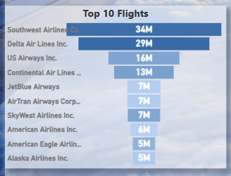
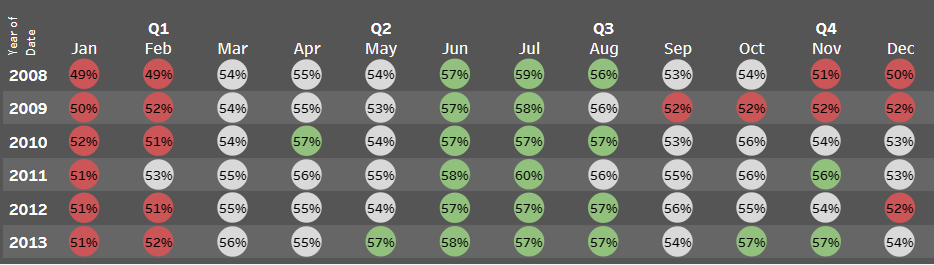

## [Project 1: Industrial Energy Combustion Model](https://github.com/RonitMalik/BlackFriday_pythonScrapper)

This Project is about in-depth facility-level information on industrial combustion energy use in the United States. 

* It provides an essential resource for understanding consumption patterns across different sectors and industries 
* It serves as an informative baseline for efficient or renewable alternative plans of operation at these facilities. 
* Gives detailed information on Facility, fuel type, Primary NAICS, MMBtu and GWht.
* **MySQL**: Remove unwanted columns, null values and created view tables
* **PowerBI** and **Tableau**: Created a fully functional integrated dashboard as per business requirements
  

### Popular Flights based on Passenger's Preference  

[Click here to interact with PowerBI Dashboard](https://app.powerbi.com/view?r=eyJrIjoiOGY3NWIzMjktMThkMi00NTQzLTljZjEtYTI3ZmJlYmQ4YTExIiwidCI6IjY4ZTczYTFhLWJjNDQtNDJhNS04OTE5LTdlOWFlZTE3ZWUzNiJ9)

### Overview of Carrier's Load factor Over time  

[Click here to interact with Tableau Dashboard](https://public.tableau.com/app/profile/akashsverma/viz/final2_16772454201710/LoadFactor)

## [Project 2: Airline Performance Model](https://github.com/RonitMalik/Movie-Recommendation-System-)

In this project I build Carrier's Performance for a United States Airline dataset.

* It provides the most precise analytics to enable airlines to optimize planning, operations and passenger services.
* Gives detailed view of Carrier's Load Factor.
* Have seach functionality of Flights between Source and Destination.
* Shows total Flights for each Distance Groups.
* Helps to measure airline on-time performance and gain insights with industry data.
* The model is build on: **Excel**, **PowerBI** and **Tableau**.
* **MySQL** is used to create views, Stored Procedures, etc 
* [Click here for Excel Dashboard](https://docs.google.com/spreadsheets/d/1net3VjV-bKPFrTyuu_3VbbXSCDGF6rV3/edit?usp=share_link&ouid=111778193148451519897&rtpof=true&sd=true)

### Popular Flights based on Passenger's Preference  

[Click here to interact with PowerBI Dashboard](https://app.powerbi.com/view?r=eyJrIjoiOGY3NWIzMjktMThkMi00NTQzLTljZjEtYTI3ZmJlYmQ4YTExIiwidCI6IjY4ZTczYTFhLWJjNDQtNDJhNS04OTE5LTdlOWFlZTE3ZWUzNiJ9)

### Overview of Carrier's Load factor Over time  

[Click here to interact with Tableau Dashboard](https://public.tableau.com/app/profile/akashsverma/viz/final2_16772454201710/LoadFactor)

